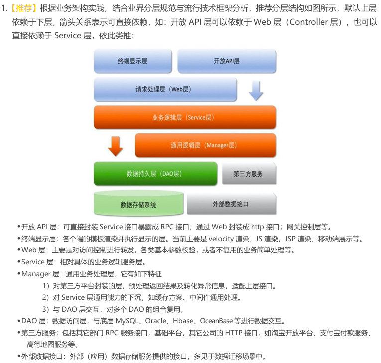

# kcodetime 架构



## 开发环境

- Visual Studio Code 1.96.4
- Python 3.13
- Vue 3 (typescript)
- redis
- postgreSQL

## 组件架构

本系统由以下组件构成：

- VS Code 插件: kcodetime
- 后端服务器: kcodetime-server
- 前端应用: kcodetime-web

## api 设计

API 采用类 RESTful 风格进行设计。为了保证与国内网络环境兼容，所有接口仅使用 GET 和 POST 方法，不支持 DELETE 等 HTTP 方法。

### POST 请求规范

请求体 (Request Body) 规范:

```json
{
  "token":"",
  "data":{
  }
}
```

- token: 令牌，需要鉴权的api需要带上此参数，默认为空即可
- data: 请求参数 响应体 (Response Body) 规范:

```json
{
  "res":{
  },
  "err-msg":"",
  "err-code": "code number"
}
```

- res：返回的数据对象，包含成功时的核心数据。若err-code不为00000，则为null
- err-msg：错误信息描述。
- err-code：错误码，详见[错误码表](err-code-table.zh.md)

### api 列表

标注为null的留空即可

#### 注册账号-获取验证码

- type: `post`
- url: `/auth/register/captcha`
- param:

  ```json
  {
    "token":"null",
    "data":{
      "type":"email",
      "account":"",
    }
  }
  ```

  - data.type 标志申请账号的第三方账号类型， 目前只支持email
  - data.account 第三方账号

- ret:

  ```json
  {
    "res":{
      "captcha":""
    },
    "err-msg":"",
    "err-code": "code number"
  }
  ```

  - res.captcha 验证码， 暂采用6位(数字+字母)验证码, 区分大小写

#### 注册账号

- type: `post`
- url: `/auth/register`
- param:

  ```json
  {
    "token":"null",
    "data":{
      "type":"email",
      "account":"",
      "psw":"",
      "captcha":""
    }
  }
  ```

- ret:

  ```json
  {
    "res":{
      "user-id":"",
      "token":""
    },
    "err-msg":"",
    "err-code": "code number"
  }
  ```

  - token: 接下来一段时间内可用的口令
  - user-id: 用户唯一id

#### 登录

- type: `post`
- url: /auth/login
- param:

  ```json
  {
    "token":"null",
    "data":{
      "type":"email",
      "account":"",
      "psw":"",
    }
  }
  ```

  - type: 第三方账号类型，暂仅支持email
  - account: 第三方账号
  - psw : 密码

- ret:

  ```json
  {
    "res":{
      "token":"",
      "user-id":""
    },
    "err-msg":"",
    "err-code": "code number"
  }
  ```

  - token: 令牌
  - user-id: 用户唯一id

#### 退出

安全退出，删除口令等

#### heartbeat

向服务端发送一段时间的编码状态

- type: `post`
- url: `/heartbeat`
- param:

  ```json
  {
    "token":"",
    "data":{
      "date":"",
      "project-name":"",
      "language":"",
      "operating-system":"",
      "char-count":"",
      "coding-duration":[
        {
          "from":"",
          "to":""
        }
      ],
      "debug-duration":[
        {
          "from":"",
          "to":""
        }
      ],
      "ide":"vscode",
      "machines":""
    }
  }
  ```

  - date: 日期
  - project-name: 项目名
  - language: 编程语言, 如markdown, cpp
  - operating-system: 炒作系统, 如windows
  - char-count：修改字符数，（增加+删除+修改）
  - coding-duration： 编码时间段
  - debug-duration： debug时间段
  - ide: 保留字段，目前仅支持vscode。
  - machines: 主机标识符

- ret:

  ```json
  {
    "res":"null",
    "err-msg":"",
    "err-code": "code number"
  }
  ```

   仅标识是否成功

#### heartbeat-confirm

用于确认状态已经更新完成，若服务端长时间未收到则应删除上一条记录

#### get-code-state

获取指定日期的编码状态统计数据

## kcodetime-server 详细设计

- [kcodetime-server 设计文档](kcodetime-server.zh.md)

## kcodetime 详细设计

- [kcodetime 设计文档](kcodetime.zh.md)

## kcodetime-web 详细设计

- [kcodetime-web 设计文档](kcodetime-web.zh.md)

## 参考资料

- [Java开发手册(黄山版).pdf](https://github.com/alibaba/p3c)
