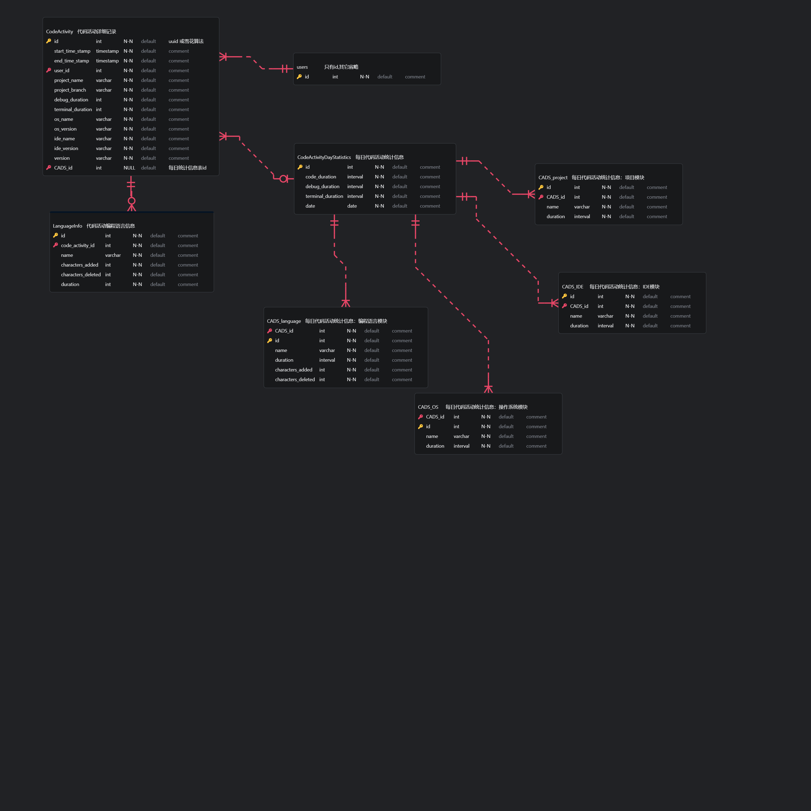

[toc]

# server 设计

## 数据库设计



## 请求规范

需要鉴权的 API 务必在请求头中附带 token 信息。 格式如下:

```
Authorization: <认证方案> <凭证信息>
```

暂使用`Customize`

## 返回规范

```json
{
  "res": {
    // response json
  },
  "err-msg": "error message outline",
  "err-msg-details":"error message details",
  "err-code": "code number"
}
```

## Auth System

### 获取注册验证码

**POST**: `/api/v1/auth/captcha`

**参数**:

```json
{
  "type": "email",
  "account": "your account"
}
```

**返回**: 将会通过email发送captcha

```json
{
  "res": {
  },
  "err-msg": "",
  "err-code": ""
}
```

### 注册账号

**POST**: `/api/v1/auth/register`

**参数**:

```json
{
  "type": "email",
  "account": "your account",
  "psw": "password",
  "captcha": "captcha code"
}
```

**返回**:

```json
{
  "res": {
    "user-id": "user identifier",
    "token": "authentication token",
    "refresh-token":""
  },
  "err-msg": "",
  "err-code": ""
}
```

### 登陆

**POST**: `/api/v1/auth/login`

**参数**:

```json
{
  "type": "email",
  "account": "your account",
  "psw": "password"
}
```

**返回**:

```json
{
  "res": {
    "token": "authentication token",
    "user-id": "user identifier",
    "refresh-token":""
  },
  "err-msg": "",
  "err-code": ""
}
```

### 刷新 Token

**POST**: `/api/v1/auth/refresh-token`

**请求头**:

```
Authorization: Customize <token>
```

**参数**

```json
{
  "refresh_token":""
}
```

**返回**:

```json
{
  "res": {
    "token": "new authentication token"
  },
  "err-msg": "",
  "err-code": ""
}
```

### 退出

**GET**: `/api/v1/auth/logout`

**请求头**:

```
Authorization: Customize <token>
```

**返回**:

```json
{
  "res": {
    "message": "logout successful"
  },
  "err-msg": "",
  "err-code": ""
}
```

### Redis

- auth:email2captcha:<$email> -> captcha
- auth:token2userid:<$token> -> user_id
- auth:userid2token:<$userid> -> token
- auth:refresh_token2userid:<$refresh_token> -> user_id
- auth:userid2refresh_token:<$userid> -> refresh_token

### 图例

#### 功能图

```mermaid
graph TD
  A[用户] -->|注册| B[注册账号]
  A -->|登录| C[登录]
  A -->|获取验证码| D[获取注册验证码]
  A -->|刷新Token| E[刷新Token]
  A -->|退出| F[退出]
```

#### 流程图

```mermaid
graph TD
    A[用户请求] -->|获取验证码| B[生成验证码]
    B --> C[存储验证码到Redis]
    C --> D[发送验证码到email]

    A -->|注册| E[验证验证码]
    E -->|成功| F[存储用户信息到PostgreSQL]
    F --> G[生成Token、refresh-token]
    G --> H[存储Token、refresh-token到Redis]
    H --> I[返回Token、refresh-token]

    A -->|登录| J[验证用户信息]
    J -->|成功| K[生成Token、refresh-token]
    K --> L[存储Token、refresh-token到Redis]
    L --> M[返回Token、refresh-token]

    A -->|刷新Token| N[验证旧Token、refresh-token]
    N -->|成功| O[生成新Token]
    O --> P[存储新Token到Redis]
    P --> Q[返回新Token]

    A -->|退出| R[删除Token]
    R --> S[返回退出成功]
```

### 架构图

```mermaid
graph TD
    A[客户端] -->|HTTPS请求| B[API服务器]
    B -->|查询| C[PostgreSQL]
    B -->|查询| D[Redis]
    B -->|返回响应| A
```

## Code Activity System

### 更新编码状态

**POST**: `/api/v1/auth/activities`

**请求头**:

```
Authorization: Customize <token>
```

**参数**:

```json
{
  "activities":[
  {
    "id" : "uuid",
    "start_time_stamp": "int",
    "end_time_stamp": "int",
    "languages" :[
      {
        "name": "string",
        "characters_added ": "int",
        "characters_deleted ": "int",
        "duration": "seconds"
      }
    ],
    "project":{
      "name":"string",
      "branch":"string"
    },
    "debug":{
      "duration": "seconds"
    },
    "terminal":{
      "duration": "seconds"
    },
    "os":{
      "name": "string",
      "version": "string"
    },
    "ide":{
      "name": "string",
      "version": "string"
    },
    "version":"string"
  }
  ]
}
```

**返回值**

```json
{
  "res":{
    "suc_ids":["id"] // 返回成功的id
  },
  // ...
}
```

#### 去重

使用redis辅助去重

```
REDIS_DUP_KEY = "activity:dedup:{activity_id}"
```

### 获取统计信息
