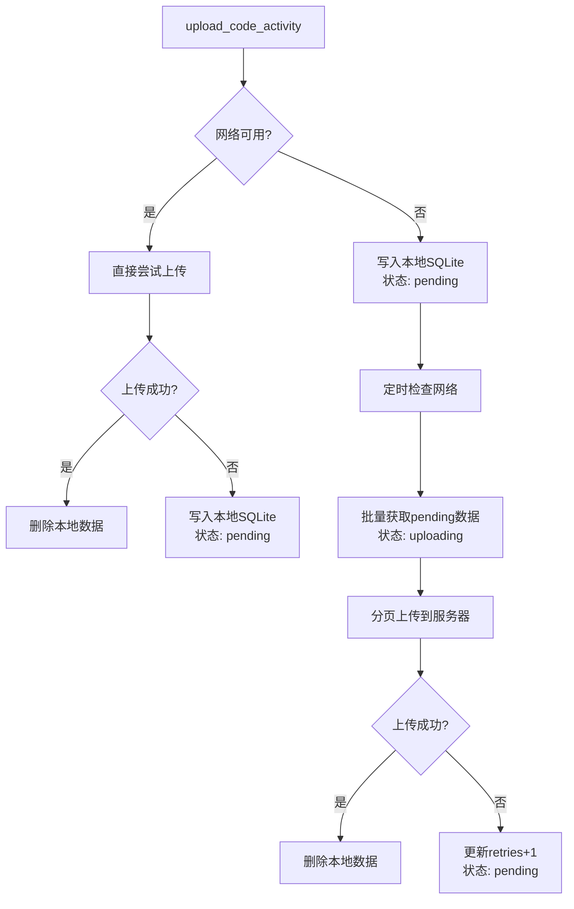

# vscode plugin 端设计方案

## 流程图

### 优化

先用轮询器/监听器统计代码活动数据修改程序**内部变量**，再用轮询器fetch/change变量来 **upload_code_activity**

### 重试策略：

指数退避重试：retryDelay = Math.min(2^retries * 1000, 30000)

最大重试次数：建议 5 次后标记为失败,并通知用户

## 存储方案

使用 SQLite 数据库（基于 better-sqlite3 或 sql.js）：

## 数据清理策略

|数据状态|保留策略|
|--|--|
|uploaded|立即删除|
|failed (retries≥5)|保留 7 天后删除|
|pending|持续重试|

## 数据上报优化策略

压缩传输：使用 gzip 压缩 JSON 数据

批量上传：每批 50-100 条记录
