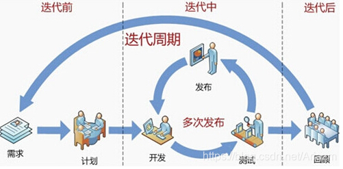

# 敏捷开发模型

定义：从1990年代开始逐渐引起广泛关注,是一种以人为核心、快速迭代、循序渐进的开发方法。强调以人为本，专注于交付对客户有价值的软件。是一个用于开发和维持复杂产品的框架。就是把一个大项目分为多个相互联系，但也可独立运行的小项目，并分别完成，在此过程中软件一直处于可使用状态。

优点：敏捷确实是项目进入实质开发迭代阶段，用户很快可以看到一个基线架构版的产品。敏捷注重市场快速反应能力，也即具体应对能力，客户前期满意度高。

缺点：但敏捷注重人员的沟通，忽略文档的重要性，若项目人员流动大太，又给维护带来不少难度，特别项目存在新手比较多时，老员工比较累。需要项目中存在经验较强的人，要不大项目中容易遇到瓶颈问题。